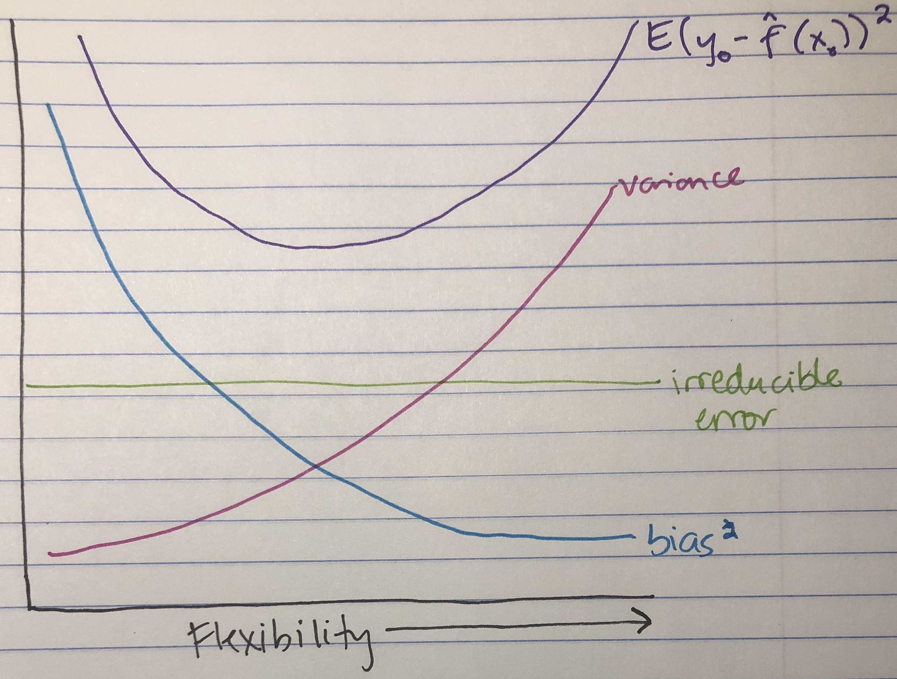
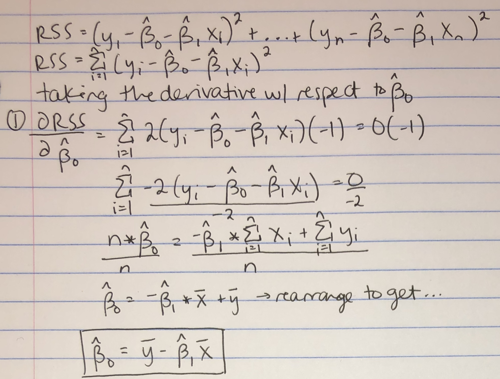

```{r setup, include=FALSE}
knitr::opts_chunk$set(echo = TRUE)
library(tidyverse)
library(class)
library(ISLR)
library(cowplot)
library(knitr)
```

***
### Question 1
For this problem, you will come up with some examples of statistical learning for biomedical or public health applications. In each example, describe $Y$ and $X_1...X_p$ as well as the scientific task.

***
#### (A) Regression problems
1. Determining how aspects of the microenvironment affect lipase activity. In this model, $x_1,x_2,x_3$ would be temperature, pH, and salinity, and $Y$ would be measured under a range of these conditions. 
2. Determining how patient income, hours of sedentary time each day, and hours of daily exercise affect the outcome of weight ($Y$). In this model, $x_1,x_2,x_3$ would be our parameters of interest: income, sedentary hours, and hours of exercise. 
3. Elucidating the effects of stress on telomere length. Here, $Y$ would be the length of patient telomeres collected from blood samples, and $x_1,x_2$ would be hours worked per week and self-reported stress levels. 

#### (B) Classification problems
1. Grouping patients into surgically actionable vs. not surgically actionable supravalvular aortic stenosis (SVAS, or narrowing of the ascending aorta) based on $x_1,x_2$ features representing (1) the speed of blood flow in the descending aorta and (2) the degree of blood perfusion in the right and left extremities. In this system, $Y$ is either in the category of surgically actionable SVAS or not surgically actionable SVAS. 
2. Classifying cancer cell lines by the signaling pathway that drives their growth, as determined by the phosphorylation level of a panel of 200 common signaling genes (measured via mass spectrometry). In this case, $Y$ would fall into the categories of: KRAS, MAPK, PI3K/AKT, Rho GTPases, or the P53 pathway. My observations $x_1,...x_{200}$ would be the phosphorylation levels of each protein. 
3. Diagnose virally-infected patients based on the key aspects of the disease presentation. The possible diagnoses ($Y$) would be: flu, cytomegalovirus, or rhinovirus. $x_1,...,x_p$ would be the measurements of viral incubation period, body temperature, and length of infection. 

#### (C) Unsupervised learning problems
1. Determining cell types from single cell RNA-seq data. In this case, $x_1,...,x_p$ would be the expression level of each gene. The goal of this clustering/dimensionality reduction algorithm would be to group cells based on similar gene expression patterns. 
2. Grouping populations based on genetic (DNA sequencing) data. For this example, $x_1,...,x_p$ would be the alleles of each individual at genomic loci that vary between groups. Here we want to group individuals into sub-populations based on shared genetic variation. 
3. Grouping tumors based on their metabolomic profiles. In this case, $x_1,...,x_p$ would represent the level of each metabolite present in the tumor. Similar to example 1, tumors would then be clustered based on similarities between the levels of metabolites present. This approach could enable targeted treatment of tumors based on their metabolic programs. 

#### (D) Inference (not prediction)
1. Given a dataset of patients who developed Type II diabetes vs. controls, I could determine which predictors are most associated with a patient's risk of developing Type II diabetes. Here, $Y$ would be a diabetes diagnosis, with $x_1,...,x_4$ being diet, exercise, genetic variant status, smoking status. 
2. Determining which genes are most involved in cellular response to a drug given based on gene expression levels. For this example, $Y$ is the cellular response and $x_1,...,x_p$ are gene expression levels during drug exposure. 
3. Track a group of children over time to identify environmental variables with the strongest effect on adult health outcomes. In this case, $Y$ would be BMI, blood pressure, and cholesterol levels while $x_1,x_2,x_3$ would be the amount of lead detected in the blood, secondhand smoke, and asbestos exposure. 

#### (E) Prediction (not inference)
1. Predicting cellular responses to stress hormones. In this case, $Y$ is the amount of reactive oxygen species produced while $x_1,...,x_p$ are observed past ROS levels from multiple cell types. 
2. Likelihood of a tumor developing drug resistance given the presence/proportion of known resistance mutations in key driver genes detected in cell free DNA. $Y$ is tumor drug resistance, while $x_1,...,x_p$ are drug resistance mutations identified by analysis of other patients' tumors. 
3. Patient response to HIV drug treatment given viral sequencing data. Here, $Y$ would be patient response to treatment (measured as a decreasing viral load), while $x_1,...,x_p$ would be sites of known HIV drug resistance mutations. This would allow doctors to develop combination therapy to appropriately target the virus. 

***
### Question 2
Consider K-nearest neighbors for classification on a data set with $n = 800$ observations. There are two classes, the "blue" class and the "orange" class. Of the $n = 800$ observations, $n_1 = 350$ belong to the orange class and $n_2 = 450$ belong to the blue class.

**(A)** Suppose we perform $K$-nearest neighbors with $K=1$. What will the training error rate be? Explain your answer. 

**(B)** Suppose we perform $K$-nearest neighbors with $K=1000$. What will the training error rate be? Explain your answer.

**(C)** What value of $K$ do we expect will result in the lowest bias? lowest variance? highest bias? Highest variance? Explain your answers. 

**(D)** Now suppose we apply the $K$-nearest neighbors model, with $K=1000$, to the training set, and we use the fitted model to classify as test observation. Will we classify this test observation to the blue class or to the orange class, or is it impossible to know without more information? Explain your answer. 

***
**(A)** With $K=1$, the training error rate would be zero. Each observation will always be assigned the value of its single neighbor and in this case, that nearest neighbor would be the observation itself since the distance between a point and itself is zero.

**(B)** With $K=1000$, the training error rate would be $350/800 = 0.4375$, or 43.75%. This is because when $K \ge n$, every observation will be assigned to the larger category, which in this example is blue. Therefore, all 350 orange observations will be incorrectly assigned as blue, giving us an error rate of 350 divided by the total $n=800$. 

**(C)** We expect that $K=1$ will result in the lowest bias and highest variance, while $K \ge n$ will result in the highest bias and lowest variance. 

**(D)** If we apply the KNN model with $K=1000$ to a test observation, it will still be classified as blue because the entire area of the plot is within the decision boundary of the largest sub-category (in this case, blue). As described in part (A), this is because the majority of the test observations are blue, so the majority of the nearest neighbors will also be blue and every subsequent sample will be classified as blue. 


***
### Question 3
In this exercise, you will analyze a classification dataset of your choice (it must have $p \le 2$). 

**(A)** What are the values of $n$ and $p$? How many classes are there, and what do they mean? What do the features mean?

**(B)** Select 2 features for your analysis. Make a plot with the two features on the $x$ and $y$ axes, and with all $n$ observations displayed. 

**(C)** Now perform $K$-nearest neighbors with a range of values of $K$, from $1$ to $n/2$. For each value of $K$, recreate teh plot from (B) and color the plot background according to the class to which a test observation with that feature value would be assigned. 

**(D)** For each value of $K$ in (C), what was the training error? 

**(E)** Based on the plots in (C), which value of $K$ do you think will give the smallest expected test error and why?

***

**(A)** I have chosen to analyze the built-in R dataset Iris. In this dataset, $n=150$ and $p=4$. There are 3 classes, which are species of iris. Each class has 50 observations. The features represent measurements of the length and width of the sepals and petals of the three iris species. The dataset originally comes from a 1936 paper by Ronald Fisher, a statistician and biologist. 

**(B)** I will analyze petal length and petal width, since I hypothesize that these features will be quite informative in classifying plants into one of the three iris species. 

```{r, echo=FALSE}

p <- ggplot(iris, aes(x=Petal.Width, y=Petal.Length, colour=Species)) + geom_point() +
  labs(x="Petal width", y="Petal length", colour="Species") + theme_bw(base_size = 14)

p

```

**(C)**
```{r}
set.seed(123)

# get training and test sets
iris.mod <- rowid_to_column(iris, "ID")

train <- iris.mod %>% sample_frac(0.7)
train <- train %>% select(-contains("Sepal"))

test <- anti_join(iris.mod, train, by="ID")
test <- test %>% select(-contains("Sepal"))

# make a grid to outline the decision boundaries
petal.grid <- expand.grid(Petal.Length = seq(min(iris$Petal.Length), 
                                            max(iris$Petal.Length), 
                                            by = 0.02),
                         Petal.Width  = seq(min(iris$Petal.Width), 
                                            max(iris$Petal.Width), 
                                            by = 0.02))

# KNN with K=1 to K=75, increasing in increments of 15
grid.pred.k1 <- knn(train[,c("Petal.Length", "Petal.Width")], 
                    petal.grid, train$Species, k=1)
k1.df <- data.frame(petal.grid, Predicted=grid.pred.k1)

grid.pred.k15 <- knn(train[,c("Petal.Length", "Petal.Width")], 
                     petal.grid, train$Species, k=15)
k15.df <- data.frame(petal.grid, Predicted=grid.pred.k15)

grid.pred.k30 <- knn(train[,c("Petal.Length", "Petal.Width")], 
                     petal.grid, train$Species, k=30)
k30.df <- data.frame(petal.grid, Predicted=grid.pred.k30)

grid.pred.k45 <- knn(train[,c("Petal.Length", "Petal.Width")], 
                     petal.grid, train$Species, k=45)
k45.df <- data.frame(petal.grid, Predicted=grid.pred.k45)

grid.pred.k60 <- knn(train[,c("Petal.Length", "Petal.Width")], 
                     petal.grid, train$Species, k=60)
k60.df <- data.frame(petal.grid, Predicted=grid.pred.k60)

grid.pred.k75 <- knn(train[,c("Petal.Length", "Petal.Width")], 
                     petal.grid, train$Species, k=75)
k75.df <- data.frame(petal.grid, Predicted=grid.pred.k75)

```

```{r, echo=FALSE}
# GRAPHS FOR KNN
q <- ggplot() + 
  geom_point(data=k1.df, mapping=aes(x=Petal.Width, y=Petal.Length, colour=Predicted), size=0.1, alpha=0.4, show.legend=FALSE) +
  geom_point(data=iris, aes(x=Petal.Width, y=Petal.Length, colour=Species), size=1.5, show.legend=FALSE) + 
  ggtitle("K=1") + labs(x="Petal width", y="Petal length", colour="Species") + theme_bw(base_size = 12) +
  theme(plot.title = element_text(hjust = 0.5)) 

r <- ggplot() + 
  geom_point(data=k15.df, mapping=aes(x=Petal.Width, y=Petal.Length, colour=Predicted), size=0.1, alpha=0.4, show.legend=FALSE) +
  geom_point(data=iris, aes(x=Petal.Width, y=Petal.Length, colour=Species), size=1.5, show.legend=FALSE) +
  ggtitle("K=15") + labs(x="Petal width", y="Petal length", colour="Species") + theme_bw(base_size = 12) +
  theme(plot.title = element_text(hjust = 0.5)) 

s <- ggplot() + 
  geom_point(data=k30.df, mapping=aes(x=Petal.Width, y=Petal.Length, colour=Predicted), size=0.1, alpha=0.4, show.legend=FALSE) +
  geom_point(data=iris, aes(x=Petal.Width, y=Petal.Length, colour=Species), size=1.5, show.legend=FALSE) +
  ggtitle("K=30") + labs(x="Petal width", y="Petal length", colour="Species") + theme_bw(base_size = 12) +
  theme(plot.title = element_text(hjust = 0.5)) 

t <- ggplot() + 
  geom_point(data=k45.df, mapping=aes(x=Petal.Width, y=Petal.Length, colour=Predicted), size=0.1, alpha=0.4, show.legend=FALSE) +
  geom_point(data=iris, aes(x=Petal.Width, y=Petal.Length, colour=Species), size=1.5, show.legend=FALSE) +
  ggtitle("K=45") + labs(x="Petal width", y="Petal length", colour="Species") + theme_bw(base_size = 12) +
  theme(plot.title = element_text(hjust = 0.5)) 

u <- ggplot() + 
  geom_point(data=k60.df, mapping=aes(x=Petal.Width, y=Petal.Length, colour=Predicted), size=0.1, alpha=0.4, show.legend=FALSE) +
  geom_point(data=iris, aes(x=Petal.Width, y=Petal.Length, colour=Species), size=1.5, show.legend=FALSE) +
  ggtitle("K=60") + labs(x="Petal width", y="Petal length", colour="Species") + theme_bw(base_size = 12) +
  theme(plot.title = element_text(hjust = 0.5)) 

v <- ggplot() + 
  geom_point(data=k75.df, mapping=aes(x=Petal.Width, y=Petal.Length, colour=Predicted), size=0.1, alpha=0.4, show.legend=FALSE) +
  geom_point(data=iris, aes(x=Petal.Width, y=Petal.Length, colour=Species), size=1.5, show.legend=FALSE) +
  ggtitle("K=75") + labs(x="Petal width", y="Petal length", colour="Species") + theme_bw(base_size = 12) +
  theme(plot.title = element_text(hjust = 0.5)) 

```

```{r, echo=FALSE}
# plotting graphs in a grid
plot_grid(q, r)
plot_grid(s, t)
plot_grid(u, v)

```


**(D)** 
```{r}

# make a vector to store the K-values
k.vals <- c(1, 15, 30, 45, 60, 75)

# make an empty vector to store the training error values that I calculate
knn.out <- c()

# loop through the K-values and calculate training error for each
for (val in k.vals){
  knn.model = knn(train[,c("Petal.Length", "Petal.Width")], 
                train[,c("Petal.Length", "Petal.Width")], 
                train$Species, k=val)
  out.df <- data.frame(train, Predicted=knn.model)
  head(out.df)
  out.df <- out.df %>% mutate(correct.call = ifelse(Species == Predicted, 1,0))
  
  train.err <- (1-(sum(out.df$correct.call/nrow(out.df))))
  knn.out <- c(knn.out, train.err)
}

tr.err.df <- data.frame("Value of K"=k.vals, "Training error"=knn.out)
kable(tr.err.df)

```


**(E)** Based on the plots in part (C), I think a $K$ value of around 15 would give me the smallest test error, while also minimizing training error (which I know we are less concerned with but should still be small). The $K=15$ plot has very low training error while still keeping test error low. Models with increasing $K$ values mis-classify greater numbers of the test set samples and also have a "wigglier" decision boundary, which is probably at least partly due to overfitting of the model to the training data and subsequent mis-classification of the test data.  

If I wanted to actually calculate the test error, I could: 
```{r}

# make an empty vector to store the test error values that I calculate
knn.test.out <- c()

# loop through the K-values and calculate test error for each
for (val in k.vals){
  knn.model = knn(train[,c("Petal.Length", "Petal.Width")], 
                test[,c("Petal.Length", "Petal.Width")], 
                train$Species, k=val)
  out.df <- data.frame(test, Predicted=knn.model)
  head(out.df)
  out.df <- out.df %>% mutate(correct.call = ifelse(Species == Predicted, 1,0))
  
  test.err <- (1-(sum(out.df$correct.call/nrow(out.df))))
  knn.test.out <- c(knn.test.out, test.err)
}

test.err.df <- data.frame("Value of K"=k.vals, "Test error"=knn.test.out)
kable(test.err.df)

```

***
### Question 4
Consider the regression model $Y=f(X)+ \epsilon$ where $\epsilon$ is the mean-zero noise term. Suppose we use training data to fit this model with a variety of techniques, each of which results in a fitted model ($\hat{f}(x)$) and makes use of a different amount of "flexibility". 

**(A)** Make a plot with "flexibility" on the $x$-axis that displays the following curves: 
* the irreducible error
* the variance of $\hat{f}(x)$
* the squared bias of $\hat{f}(x)$
* $E(y_{0}-\hat{f}(x_{0}))^2$, where $(x_0,y_0)$ is a test observation

**(B)** Explain how the data displayed on the plot ties into the bias-variance tradeoff. 

***

**(A)** 
```{r, echo=FALSE, out.width = "350pt"}

```

**(B)** Each line on the plot represents a different aspect that we should consider when choosing a machine learning model. Specifically: 

1. The bias$^2$ decreases as model flexibility increases. As model flexibility increases, the $\hat{f}(x)$ will be fit more closely to the training dataset (the "wiggliness" of our model will increase), meaning that the bias, which represents the distance between the average $\hat{f}(x)$ and the true $f(x)$ will decrease. 
2. Variance, or how spread out our different estimates of $f(x)$ are, increases as model flexibility increases. As the $\hat{f}(x)$ prediction is fit more closely to the training data, variance among different training sets will increase because we are essentially "connecting the dots" (or interpolating) between all of our training observations. Therefore our $\hat{f}(x)$ will vary greatly depending on which training set we use. 
3. The irreducible error remains the same regardless of model flexibility. 
4. $E(y_{0}-\hat{f}(x_{0}))^2$, which represents the sum of the three previous terms, forms a U-shaped curve, with maxima at very low and very high values of flexibility. With each model, we want to find a model that minimizes the value of this equation, so that we can find the lowest possible bias and variance. 

***
### Question 5
Suppose that you are interested in performing regression on a particular dataset, and need to decide whether to take a parametric or a non-parametric approach. Describe what properties of the dataset or the scientific context you might use to make this decision. What properties would lead you to *definitely* use a parametric approach? What properties would lead you to *defnitely* use a non-parametric approach?

***

In general, I would use a **parametric** approach in cases where I had a smaller sample size and/or few parameters, and where the relationship between my response and predictors roughly matched or could be transformed to match a known function (such as a linear model). I would *definitely* use a parametric approach if the response-predictor relationship was very close to a known function, since this would be quite interpretable and powerful. 

I would use a **non-parametric** approach in cases where I had a very large number of samples and/or parameters, or in cases where I did not think the relationship between my response and predictors matched a known model, or in cases where I only wanted to predict an outcome and did not care about the impact of individual parameters on the outcome. Overall, I would be less likely to *definitely* use a non-parametric model given the danger of overfitting. But I would be more likely to use such a model in cases where I had a large number of observations, I did not think that the response-predictor relationship was close to a known function, and where my goal was prediction rather than inference. 

***
### Question 6
This problem has to do with linear regression. 

**(A)** For a simple linear regression, show that the least squares coefficient estimates take the form shown in (3.4) of the textbook. In other words, prove that the coefficients that maximize (3.3) satisfy the equation in (3.4). 

**(B)** Now, write your own function in `R` to calculate $\hat{\beta}_0$ and $\hat{\beta}_1$ from (3.4) in the textbook. 

**(C)** On some examples, show that the function you wrote gives the same result as the `lm` function in `R`. 

***

**(A)**
Part 1: 
```{r, echo=FALSE, out.width = "350pt"}

```

Part 2: 
```{r, echo=FALSE, out.width = "350pt"}

```


**(B)**
```{r}

lin.reg <- function(x, y){
  mean.x <- mean(x)
  mean.y <- mean(y)
  
  B1.num <- sum((x - mean.x)*(y - mean.y))
  B1.denom <- sum((x - mean.x)^2)
  B1.hat <- (B1.num/B1.denom)
  B1.hat <- round(B1.hat, digits=4)
  
  B0.hat <- (mean.y - B1.hat*mean.x)
  B0.hat <- round(B0.hat, digits=4)
  
  results <- data.frame(Beta0.est=B0.hat, Beta1.est=B1.hat)
  kable(results)
}

```

**(C)**
Iris dataset example: 
```{r}
# with my model
iris.reg1 <- lin.reg(iris$Petal.Length, iris$Petal.Width)
iris.reg1

# with built-in lm() function
iris.reg2 <- lm(Petal.Width ~ Petal.Length, data=iris)
iris.reg2

```

Cars dataset example: 
```{r}

# with my model
cars.reg1 <- lin.reg(cars$speed, cars$dist)
cars.reg1

# with built-in lm() function
cars.reg2 <- lm(dist ~ speed, data=cars)
cars.reg2

```


