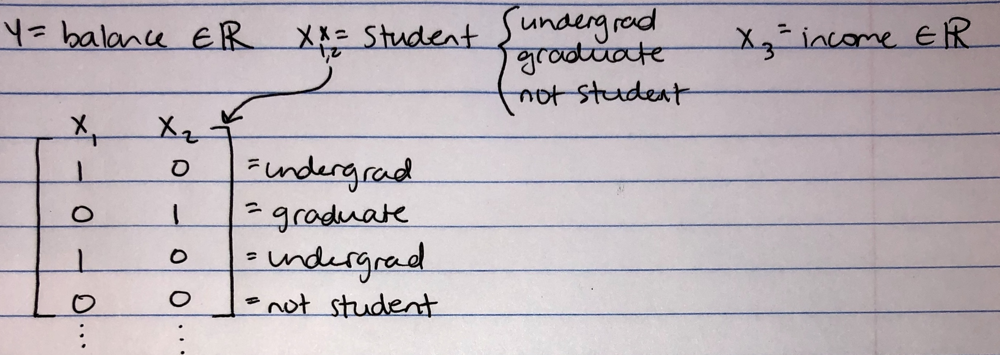

```{r setup, include=FALSE}
library(tidyverse)
library(ISLR)
library(mlbench)
library(MASS)
library(kableExtra)
```

***
### Question 1

Consider classification with $K$ classes and one feature, $p=1$. In lecture, we went through a detailed argument to see that the discriminant function for linear discriminant analysis (which assumes that an observation in the $k$th class is drawn from a $N(\mu_k, \sigma^2)$ distribution) is of the form given in
Equation 4.13 of the textbook.

**(A)** Consider quadratic discriminant analysis, which assumes that an observation in the $k$th class is drawn from an $N(\mu_k, \sigma^2_k)$ equation. Derive the discriminant function for quadratic discriminant analysis. 
 
**(B)** Comment on the difference between Equation 4.13 and your answer in (A). Explain how we can see that the discriminant functions are for linear discriminant analysis and quadratic discriminant analysis are *linear* and *quadratic*, respectively.

***

**(A)** I first took the log of the QDA equation to get: 
```{r, echo=FALSE, out.width = "350pt"}

```

**(B)** The difference between my equation in Part A and equation 4.13 is the $x^2$ term, which is what makes the QDA equation quadratic in $x$. 


***
### Question 2

Choose a data set with $p=2$ features $X_1$ and $X_2$, a qualitative response $Y$ with $K=3$ classes, and at least 15 observations per class. We are going to predict $Y$ using $X_1$ and $X_2$. 

**(A)** Briefly describe the data. Where did you get it? Describe the $K$ classes and the $p$ features. Explain the classification task in words. 

**(B)** Fit an LDA model to the data. Make a plot with $X_1$ and $X_2$ on the horizontal and vertical axes, and with the observations displayed and colored according to their true class labels. On the plot, indicate which observations are incorrectly classified.

**(C)** Fit a QDA model to the data. Make a plot with $X_1$ and $X_2$ on the horizontal and vertical axes, and with the observations displayed and colored according to their true class labels. On the plot, indicate which observations are incorrectly classified.

**(D)** Of the two models, which one gave you the smallest training error? How does this relate to the bias-variance trade-off?

**(E)** Which of these three models do you expect will give you the smallest test error? Explain your answer. How does this relate to the bias-variance trade-off?


***

**(A)** These data are from the built-in `R` dataset Iris. In this example, I will use the length and width of sepals to classify each sample into a species (setosa, virginica, or versicolor).  
```{r}

set.seed(123)

# plot the iris dataset
ggplot(iris, aes(x=Sepal.Width, y=Sepal.Length, colour=Species)) +
geom_point() + theme_bw(base_size=12) +
labs(x="Sepal Width", y="Sepal Length")

```

```{r}

# split data into training and test sets
iris.mod <- rowid_to_column(iris, "ID")
train <- iris.mod %>% sample_frac(0.75)
test <- anti_join(iris.mod, train, by="ID")

```


**(B)**

```{r}

lda.iris <- lda(Species ~ Sepal.Width + Sepal.Length, data=train)
lda.pred.iris <- predict(lda.iris, train)$class

# add a binary variable to train.lda to indicate whether the LDA prediction was correct
# 1=correct, 0=incorrect
train.lda <- train %>% mutate(lda.correct = ifelse(lda.pred.iris == Species, 1, 0))

# plot training data with LDA predictions
ggplot(data=train.lda, aes(x=Sepal.Width, y=Sepal.Length)) +
geom_point(aes(colour=Species, shape=as.factor(lda.correct))) +
theme_bw(base_size=12) + labs(x="Sepal Width", y="Sepal Length",
shape="Prediction: LDA") +
scale_shape_discrete(labels=c("Incorrect", "Correct"))

```

```{r}

cat("LDA training error =", 1-(sum(train.lda$lda.correct)/nrow(train.lda)))

```

**(C)**
```{r}

# fit a QDA model to the data
qda.iris <- qda(Species ~ Sepal.Width + Sepal.Length, data=train)
qda.pred.iris <- predict(qda.iris, train)$class

# add a binary variable to train.lda to indicate whether the LDA prediction was correct
# 1=correct, 0=incorrect
train.qda <- train %>% mutate(qda.correct = ifelse(qda.pred.iris == Species, 1, 0))

# plot training data with QDA predictions
ggplot(data=train.qda, aes(x=Sepal.Width, y=Sepal.Length)) +
geom_point(aes(colour=Species, shape=as.factor(qda.correct))) +
theme_bw(base_size=12) + labs(x="Sepal Width", y="Sepal Length",
shape="Prediction: QDA") +
scale_shape_discrete(labels=c("Incorrect", "Correct"))

```

```{r}

cat("QDA training error =", 1-(sum(train.qda$qda.correct)/nrow(train.qda)))

```


**(D)** In general, I would expect QDA to give a smaller training error than LDA, since it is a more flexible model that estimates more parameters and has lower bias overall. However, the actual training error will depend on our data. Factors such as smaller sample size, an approximately linear decision boundary shape, and an equal covariance matrix across classes could affect the training error rate, and might cause LDA to have a smaller training error than QDA. In the example I chose, it looks like LDA actually gives a lower training error than QDA (training error = 0.188 for LDA and 0.214 for QDA).

**(E)** Again, due to our small sample size I would expect LDA to give a smaller test error (assuming that the assumption of an equal covariance matrix between our classes holds). This would also depend on the true
shape of the decision boundaries - if they are linear, then LDA will perform better than QDA. Additionally,
since we estimate fewer parameters for LDA, we would expect this type of model to be less likely to overfit
the training data, and therefore perform better on the test dataset. If however the decision boundaries were moderately non-linear, and if we had a larger sample size, QDA might perform better. In this example, from actually calculating the test error, it looks like the LDA model performed better.

```{r}

# Calculating test error for LDA and QDA
lda.pred.iris.test <- predict(lda.iris, test)$class
test.lda <- test %>% mutate(lda.correct = ifelse(lda.pred.iris.test == Species, 1, 0))
qda.pred.iris.test <- predict(qda.iris, test)$class
test.qda <- test %>% mutate(qda.correct = ifelse(qda.pred.iris.test == Species, 1, 0))

cat("LDA test error =", 1-(sum(test.lda$lda.correct)/nrow(test.lda)))
cat("\nQDA test error =", 1-(sum(test.qda$qda.correct)/nrow(test.qda)))

```

***
### Question 3
Suppose we have a quantitative response $Y$, and two quantitative features $X_1$ and $X_2$.
Let $RSS_1$ denote the residual sum of squares that results from fitting the model
$$Y = \beta_0 + \beta_1X_1 + \epsilon $$
using least squares. Let $RSS_{12}$ denote the residual sum of squares that results
from fitting the model
$$Y = \beta_0 + \beta_1X_1 + \beta_2X_2 + \epsilon $$
using least squares.

Perform the following procedure a whole lot of times (you will need to write a for loop to do this):

* Simulate $Y$, $X_1$, and $X_2$ with $n = 200$. You can generate each element of $X_1$ and $X_2$ independently from a $N(0,1)$ distribution, and you can generate $Y$ according to $Y = 3 + 2X_1 - X_2 + \epsilon$, where the elements of $\epsilon$ are independent draws from a $N(0,1)$ distribution.
* Fit the two models using least squares.
* Compare the values of $RSS_{12}$ and $RSS_1$.
* Compare the $R^2$ values for the two models.

Describe your findings. Which of the two models is more flexible? Which model has smaller training RSS, and which model has larger training $R^2$? How would you expect the two models to perform on test data? How do your findings relate to the bias-variance trade-off?

***

```{r}

set.seed(123)

# define empty vectors to store output from lm for each model
rss.1 <- c()
r2.1 <- c()
rss.12 <- c()
r2.2 <- c()

for (i in 1:200){
  x1 <- rnorm(200, 0, 1)
  x2 <- rnorm(200, 0, 1)
  epsilon <- rnorm(200, 0, 1)
  y = 3 + 2*x1 - x2 + epsilon
  df <- data.frame(y=y, x1=x1, x2=x2)
  
  # fit linear model 1
  lm1 <- lm(y ~ x1, data=df)
  r2.1 <- c(r2.1, summary(lm1)$r.squared)
  rss.1 <- c(rss.1, sum(resid(lm1)^2))
  
  # fit linear model 2
  lm2 <- lm(y ~ x1 + x2, data=df)
  r2.2 <- c(r2.2, summary(lm2)$r.squared)
  rss.12 <- c(rss.12, sum(resid(lm2)^2))
}

```

```{r, message=FALSE, warning=FALSE}

lm1.out.df <- tibble("Rsquared" = r2.1, "RSS" = rss.1) %>% mutate("which_lm" = 1)
lm2.out.df <- tibble("Rsquared" = r2.2, "RSS" = rss.12) %>% mutate("which_lm" = 2)

# make a dataframe to store R^2 and RSS values from each model
lm.out.df <- bind_rows(lm1.out.df, lm2.out.df)

```

```{r, echo=FALSE}

lm.out.df %>%
  mutate(which_lm = factor(which_lm, levels = c("1", "2"))) %>%
  ggplot(aes(x = Rsquared, fill = which_lm)) +
  geom_histogram(color = "black", position = "identity") +
  theme_bw() +
  labs(x = "R^2", y = "Count", fill = "Linear model")

```

```{r, echo=FALSE}

lm.out.df %>%
  mutate(which_lm = factor(which_lm, levels = c("1", "2"))) %>%
  ggplot(aes(x = RSS, fill = which_lm)) +
  geom_histogram(color = "black", position = "identity") +
  theme_bw() +
  labs(x = "Residual sum of squares", y = "Count", fill = "Linear model")

```

The RSS value for model 2 is generally less than the RSS for model 1. The $R^2$ value for model 2 is greater than the $R^2$ for model 1. This is because model 2 is more flexible, leading to a higher fit to the training data with lower variance and higher $R^2$. This means that model 2 is more likely to be overfit to the training data, so it would have lower training error. However, this also means that model 2 is likely to have higher test error overall.

***
### Question 4

This question involves the use of multiple linear regression on the `Auto` dataset, which is available as part of the `ISLR` library.

**(A)** Use the `lm()` function to perform a multiple linear regression with `mpg` as the response and all other variables except `name` as the predictors. Use the `summary()` function to print the results. Comment on the output. For instance:
i. Is there a relationship between the predictors and the response?
ii. Which predictors appear to have a statistically significant relationship
to the response?
iii. Provide an interpretation for the coefficient associated with the variable `year`.

**(B)** Try out some models to predict mpg using **functions of** the variable `horsepower`. Comment on the best model you obtain. Make a plot with `horsepower` on the x-axis and `mpg` on the y-axis that displays both the observations and the fitted function (i.e. $\hat{f}$`horsepower`).

**(C)** Now fit a model to predict `mpg` using `horsepower`, `origin`, and an interaction between `horsepower` and `origin.` Make sure to treat the qualitative variable `origin` appropriately. Comment on your results. Provide a careful interpretation of each regression coefficient.

***

**(A)** 
```{r}

# convert "origin" variable to factor
Auto <- Auto %>% mutate(origin=as_factor(origin))

# fit linear regression model to the data
auto.mpg.lm <- lm(mpg ~ cylinders + displacement + horsepower +
weight + acceleration + year + origin, data=Auto)
summary(auto.mpg.lm)

```

**(i)** There does seem to be a relationship between the predictors and response, as the $R^2$ value is 0.82 and the coefficient estimates are either greater than or less than zero.

**(ii)** The predictors displacement, weight, year, and origin seem to have a statistically significant relationship to the response, with $p < 0.05$ for each predictor.

**(iii)** For each one-unit increase in "year" (as the car model gets newer), there is an average gain of
0.777 mpg.

**(B)** 

```{r, message=FALSE, warning=FALSE}

ggplot(data=Auto, aes(x=horsepower, y=mpg)) + geom_point() + theme_bw(base_size=12) +
  stat_smooth(method='lm', formula=y ~ poly(x,2), aes(colour='Polynomial'), se=FALSE) +
  stat_smooth(method='nls', formula=y ~ a*log(x) +b, aes(colour = 'Logarithmic'),
              se = FALSE, start = list(a=1,b=1)) +
  geom_smooth(method='lm', aes(colour="Linear"), se=FALSE) +
  labs(x="Horsepower", y="MPG", colour="Fitted\nfunction:")
  
```

```{r}

auto.linear.lm <- lm(mpg ~ horsepower, data=Auto)
lin.rsquared <- summary(auto.linear.lm)$r.squared

auto.log.lm <- lm(mpg ~ log(horsepower), data=Auto)
log.rsquared <- summary(auto.log.lm)$r.squared

auto.poly.lm <- lm(mpg ~ poly(horsepower,2), data=Auto)
poly.rsquared <- summary(auto.poly.lm)$r.squared

auto.R2.df <- tibble("Function"=c("linear", "logistic", "polynomial"),
                     "Rsquared"=c(lin.rsquared, log.rsquared, poly.rsquared))

kable(auto.R2.df)

```


Here, it looks like the polynomial function of horsepower gives the highest $R^2$ value of 0.686. This is the model I would choose.

**(C)** 
```{r}

auto.mpg.lm2 <- lm(mpg ~ horsepower + origin + horsepower*origin, data=Auto)
summary(auto.mpg.lm2)

```

* The intercept is the value that you would get if all other variables were zero. In this case, it would be the value for an American car with zero horsepower.
* The regression coefficient for **horsepower** is the mean amount that a change in horsepower is associated with a change in the car’s gas mileage (MPG).
* The regression coefficient for **origin2** is the mean amount that a car being a European model is associated with a change in gas mileage (MPG).
* The regression coefficient for **origin3** is the mean amount that a car being a Japanese model is associated with a change in gas mileage (MPG).
* The interactions between horsepower and origin2 or origin3 represent the average amount that a car being from either Europe or Japan impacts its gas mileage as a function of the car’s horsepower.

***
### Question 5

Consider fitting a model to predict credit card balance using `income` and `student`, where `student` is a qualitative variable that takes on one of three values: `{graduate, undergraduate, not student}`.

**(A)** Encode the `student` variable using two dummy variables, one of which equals 1 if `student=graduate` (and 0 otherwise), and one of which equals 1 if `student=undergraduate` (and 0 otherwise). Write out an expression for a linear model to predict balance using income and student, using this coding of the dummy variables. Interpret the coefficients in this linear model.

**(B)** Now encode the student variable using two dummy variables, one of which equals 1 if `student=not student` (and 0 otherwise), and one of which equals 1 if `student=graduate` (and 0 otherwise). Write out an expression for a linear model to predict balance using income and student, using this coding of the dummy variables. Interpret the coefficients in this linear model.

**(C)** Using the coding in (A), write out an expression for a linear model to predict balance using `income`, `student`, and an interaction between `income` and `student.` Interpret the coefficients in this model.

**(D)** Using the coding in (B), write out an expression for a linear model to predict balance using `income`, `student`, and an interaction between `income` and `student.` Interpret the coefficients in this model.

**(E)** Using simulated data for balance, income, and student, show that the fitted values (predictions) from the models in (A)-(D) do not depend on the coding of the dummy variables (i.e. the models in (A) and (B) yield the same fitted values, as do the models in (C) and (D)).


***

**(A)** I would define the variables as follows. I’ve also included an example dummy variable coding matrix:

```{r, echo=FALSE, out.width = "350pt"}

```

The equation for this model would be: $$Y = \beta_0 + \beta_1\tilde{x}_{i1} + \beta_2\tilde{x}_{i2} + \beta_3x_3$$

*Explanation of coefficients:*

Given my dummy variable coding scheme, $\tilde{x}_{i1}=0$ if the student is a graduate, or $\tilde{x}_{i1}=1$ if the student is an undergrad.

$\tilde{x}_{i2}=1$ if the student is a graduate; $\tilde{x}_{i2}=0$ if the student is an undergrad. If both $\tilde{x}_{i1}=0$ and $\tilde{x}_{i2}=0$, the person is not a student.

$x_3$ is the person’s income.

$\beta_1$ is the mean amount that an undergraduate’s balance differs from a non-student’s balance.

$\beta_2$ is the mean amount that a graduate student’s balance differs from a non-student’s balance.

$\beta_3$ is the mean amount that a change in income is associated with a change in balance.

$\beta_0$ is the y-intercept, or the expected balance when all other coefficients are zero.


**(B)** The definitions of the variables would be the same as part A. A sample matrix for the dummy variables would look something like this:

```{r, echo=FALSE, out.width = "350pt"}

```

The equation for this model would be: $$Y = \beta_0 + \beta_1\tilde{x}_{i1} + \beta_2\tilde{x}_{i2} + \beta_3x_3$$

*Explanation of coefficients:*

Given my dummy variable coding scheme, $\tilde{x}_{i1}=1$ if the student is a graduate, or $\tilde{x}_{i1}=0$ if the person is a non-student.

$\tilde{x}_{i2}=0$ if the student is a graduate student; $\tilde{x}_{i2}=1$ if the person is a non-student. If both $\tilde{x}_{i1}=0$ and $\tilde{x}_{i2}=0$, the person is an undergraduate student.

$x_3$ is the person’s income.

$\beta_1$ is the mean amount that an graduate student’s balance differs from an undergraduate student's balance.

$\beta_2$ is the mean amount that a non-student’s balance differs from an undergraduate student’s balance.

$\beta_3$ is the mean amount that a change in income is associated with a change in balance.

$\beta_0$ is the y-intercept, or the expected balance when all other coefficients are zero.


**(C)** The equation for this model would be: $$Y = \beta_0 + \beta_1\tilde{x}_{i1} + \beta_2\tilde{x}_{i2} + x_3(\beta_3+\beta_{13}x_{i1}+\beta_{23}x_{i2})$$

*Explanation of coefficients:*

Here, the coding of $\tilde{x}_{i1}$ and $\tilde{x}_{i2}$ are the same as in Part A. The first three coefficients of the model have the same interpretations. In addition: 

$x_3$ is the person's income.

$\beta_3$ is the mean amount that a change in income is associated with a change in balance.

$\beta_{13}$ represents the average amount that your income impacts your balance if you are an undergraduate. This is an interaction variable, so here balance is a function of both income and student status.

$\beta_{23}$ represents the average amount that your income impacts your balance if you are a graduate student. As above, this is an interaction variable, so balance is a function of both income and student status.


**(D)** The equation for this model would be: $$Y = \beta_0 + \beta_1\tilde{x}_{i1} + \beta_2\tilde{x}_{i2} + x_3(\beta_3+\beta_{13}x_{i1}+\beta_{23}x_{i2})$$

*Explanation of coefficients:*

Here, the coding of $\tilde{x}_{i1}$ and $\tilde{x}_{i2}$ are the same as in Part B. The first three coefficients of the model have the same interpretations. In addition: 

$x_3$ is the person's income.

$\beta_3$ is the mean amount that a change in income is associated with a change in balance.

$\beta_{13}$ represents the average amount that your income impacts your balance if you are a graduate student This is an interaction variable, so here balance is a function of both income and student status.

$\beta_{23}$ represents the average amount that your income impacts your balance if you are a non-student. As above, this is an interaction variable, so balance is a function of both income and student status.


**(E)**
```{r}

set.seed(123)

# generate simulated dataset
student = c(rep("undergraduate", 50), rep("graduate", 50), rep("not_student", 50))
income = rnorm(150, 3500, 1000)
balance = rnorm(150, 2000, 800)

# make a dataframe where the dummy variable reference value is not_student
student.df1 <- tibble(student = factor(student, ordered=FALSE), income, balance) %>%
  mutate(student = relevel(student, ref="not_student"))

# make a dataframe where the dummy variable reference value is undergraduate
student.df2 <- tibble(student = factor(student, ordered=FALSE), income, balance) %>%
  mutate(student = relevel(student, ref="undergraduate"))

# model for part A
lm1.student <- lm(balance ~ student + income, data=student.df1)

# store coefficients from this model to use later
lm1.coef <- lm1.student$coefficients

# model for part B
lm2.student <- lm(balance ~ student + income, data=student.df2)
lm2.coef <- lm2.student$coefficients

# model for part C
lm3.student <- lm(balance ~ student + income + student*income, data=student.df1)
lm3.coef <- lm3.student$coefficients

# model for part D
lm4.student <- lm(balance ~ student + income + student*income, data=student.df2)
lm4.coef <- lm4.student$coefficients

student.rsquared.df <- tibble(Model=c("Part A", "Part B", "Part C", "Part D"),
                              Rsquared=c(summary(lm1.student)$r.squared,
                                         summary(lm2.student)$r.squared,
                                         summary(lm3.student)$r.squared,
                                         summary(lm4.student)$r.squared))
kable(student.rsquared.df)

```

If we look at the $R^2$ values, $A=B$ and $C=D$ as we would expect.


For an arbitrary student, say, a graduate student with a monthly income of $3,000, we can then use each model to predict their monthly balance.

```{r}

income <- 3000

i1 <- lm1.coef[1] + lm1.coef[2]*1 + lm1.coef[3]*0 + lm1.coef[4]*income
i2 <- lm2.coef[1] + lm2.coef[2]*1 + lm2.coef[3]*0 + lm2.coef[4]*income
i3 <- lm3.coef[1] + lm3.coef[2]*1 + lm3.coef[3]*0 + lm3.coef[4]*income +
  lm3.coef[5]*1*income + lm3.coef[6]*0*income
i4 <- lm4.coef[1] + lm4.coef[2]*1 + lm4.coef[3]*0 + lm4.coef[4]*income +
  lm4.coef[5]*1*income + lm4.coef[6]*0*income

grad.predict.df <- tibble("Model"=c("A", "B", "C", "D"),
                          "Predicted balance"=c(i1, i2, i3, i4))

kable(grad.predict.df)

```

Comparing the predictions from each pair of models, $A=B$ and $C=D$.

